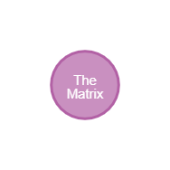
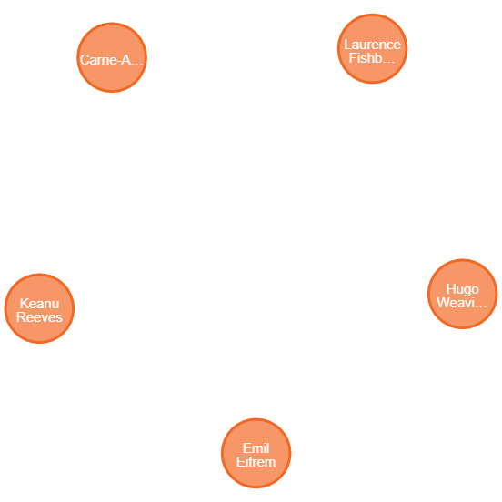
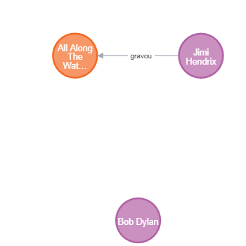
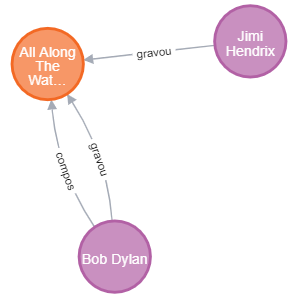
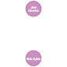
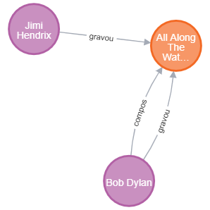
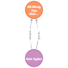
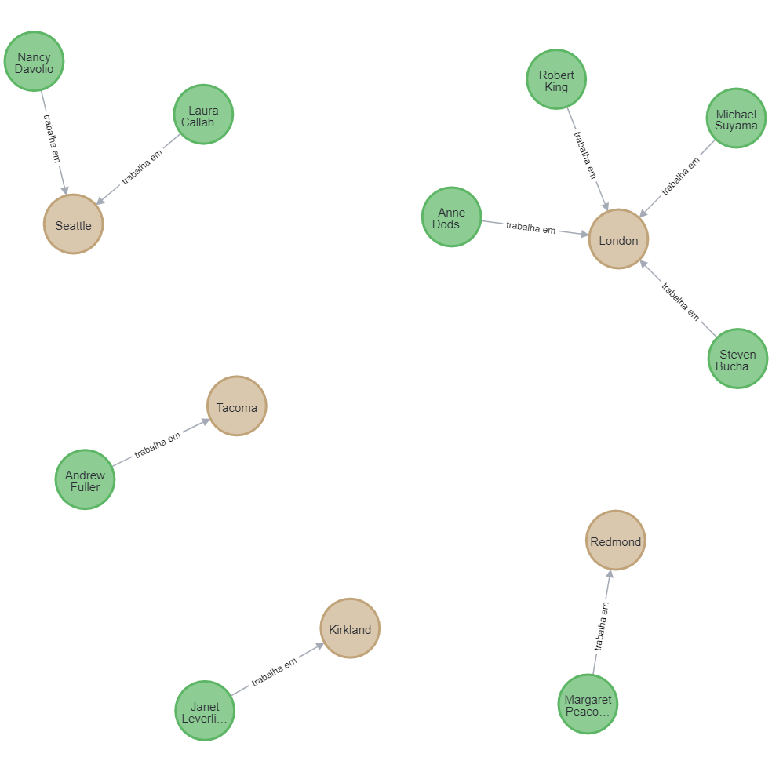
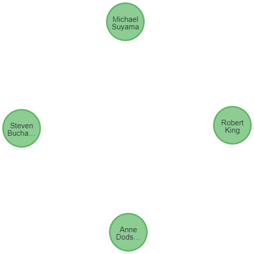

<center>
Universidade Federal da Paraíba – Campus I Centro de Informática
</center>

<center>
Departamento de Informática
</center>

### Big Data: conceitos e aplicações 

#### Laboratório 5: Modelo Orientado a Grafos

Aluna: Emmanuella Faustino Albuquerque

-----------------------------------------------------------

## 1. Cypher Introduction - Social Movie Database

### Tipos de relacionamentos do dataset

**Entrada** (.cypher)

Com base nos nós, retorna o tipo de relacionamento de cada um deles.

```sql
MATCH (n)-[r]->()
RETURN type(r), count(*);
```

**Saída** (.json)

```json
[
  {
    "type(r)": "ACTED_IN",
    "count(*)": 172
  },
  {
    "type(r)": "DIRECTED",
    "count(*)": 44
  },
  {
    "type(r)": "PRODUCED",
    "count(*)": 15
  },
  {
    "type(r)": "WROTE",
    "count(*)": 10
  },
  {
    "type(r)": "FOLLOWS",
    "count(*)": 3
  },
  {
    "type(r)": "REVIEWED",
    "count(*)": 9
  }
]
```

**Entrada** (.cypher)
```sql
MATCH (n)
RETURN "Hello Graph with "+count(*)+" Nodes!"
as welcome;
```

**Saída** (.json)

```json
[
  {
    "welcome": "Hello Graph with 171 Nodes!"
  }
]
```

### Primeiros passos com Cypher

**Entrada** (.cypher)

Retornando as informações de um nó filme específico.

```sql
MATCH (movie:Movie {title:"The Matrix"})
RETURN movie;
```

**Saída**

```js
// node properties
<id>: 0
released: 1999
tagline: Welcome to the Real World
title: The Matrix
```



**Entrada**

Retornando somente as informações necessárias na consulta de um filme específico.

```sql
MATCH (movie:Movie {title:"The Matrix"})
RETURN movie.id, movie.title;
```

**Saída**

```json
[
  {
    "movie.id": null,
    "movie.title": "The Matrix"
  }
]
```

**Entrada**

Retornando somente os atores que atuaram em um filme específico.

OBS: Ator é um nó com aresta não incidente, ou seja, uma aresta que saí dele (ator) e chega no filme. E o filme, possui uma aresta incidente, já que a aresta chega nele.  

```sql
MATCH (m:Movie {title:"The Matrix"})<-[:ACTED_IN]-(actor)
RETURN actor;
```

**Saída**



**Entrada**

Retornando o nome do ator que atuou em um filme específico.

```sql
MATCH (m:Movie {title:"The Matrix"})<-[:ACTED_IN]-(actor)
RETURN actor.name order by actor.name;
```

**Saída**

```json
[
  {
    "actor.name": "Carrie-Anne Moss"
  },
  {
    "actor.name": "Emil Eifrem"
  },
  {
    "actor.name": "Hugo Weaving"
  },
  {
    "actor.name": "Keanu Reeves"
  },
  {
    "actor.name": "Laurence Fishburne"
  }
]
```

**Entrada**

Retornando o número de atores que atuaram em um filme específico.

```sql
MATCH (m:Movie {title:"The Matrix"})<-[:ACTED_IN]-(actor)
RETURN count(*);
```

**Saída**

```json
[
  {
    "count(*)": 5
  }
]
```

**Entrada**

Retornando o nome dos atores (terminados em s) que atuaram em um filme específico.

```sql
MATCH (m:Movie {title:"The Matrix"})<-[:ACTED_IN]-(actor)
WHERE actor.name =~ ".*s$"
RETURN actor.name;
```

**Saída**

```json
[
  {
    "actor.name": "Carrie-Anne Moss"
  },
  {
    "actor.name": "Keanu Reeves"
  }
]
```

## 2. Músicos e Músicas gravadas (n-n)

### Criando arestas (Relacionamentos)

```sql
-- Criando nós dos músicos

CREATE(dylan:Musico{nome:'Bob Dylan', data_de_nascimento: '1941-05-24'})

CREATE(hendrix:Musico{nome:'Jimi Hendrix'})

CREATE(hendrix:Musico{nome:'Jimi Hendrix'})
```

```sql
-- Criando nós das músicas

CREATE(al_along:Musica{nome:'All Along The Watchtower'})
```

```sql
-- Criando aresta (relacionamento)

MATCH (hendrix:Musico{nome:'Jimi Hendrix'}),(al_along:Musica{nome:'All Along The Watchtower'})

-- r: relacionamento e ->: direção
CREATE (hendrix)-[r:gravou]->(al_along)
```

**Saída**

```sql
MATCH (m)
RETURN m
```



```sql
MATCH (bob:Musico {nome: 'Bob Dylan'}), (al_along:Musica {nome: 'All Along The Watchtower'})
CREATE (bob)-[r:gravou]->(al_along)
CREATE (bob)-[s:compos]->(al_along)
```

**Saída**

```sql
MATCH (m)
RETURN m
```



### Utilizando filtros

```sql
MATCH(m:Musico {nome: 'Bob Dylan'})
RETURN m
```
**Saída**

```sql
MATCH (m)
RETURN m
```


```js
// node properties
<id>: 0
data_de_nascimento: 1941-05-24
nome: Bob Dylan
```

### Testando retornos

- nós com arestas incidentes (que chegam)
```sql
MATCH (n1)<-[]-()
RETURN n1
```


- nós com arestas não incidentes (que saem)
```sql
MATCH (n1)-[]->()
RETURN n1
```



- todos os relacionamentos
```sql
MATCH (n1:Musico)-[r]->(n2:Musica)
RETURN n1, type(r), n2
```



```json
// Table Result Example

// n1
{
  "identity": 0,
  "labels": [
    "Musico"
  ],
  "properties": {
"nome": "Bob Dylan",
"data_de_nascimento": "1941-05-24"
  }
}

// type(r)
"compos"

// n2
{
  "identity": 2,
  "labels": [
    "Musica"
  ],
  "properties": {
"nome": "All Along The Watchtower"
  }
}

...
```

- todos os relacionamentos com filtro
```sql
MATCH (n1:Musico)-[r:compos]->(n2:Musica)
RETURN n1, type(r), n2
```



### Atualizando os elementos criados

- Modificando ou adicionando um atributo
```sql
MATCH (hendrix:Musico {nome: 'Jimi Hendrix'})
SET hendrix.data_de_nascimento = '1942-11-27'
```

- Excluindo um atributo
```sql
MATCH (hendrix:Musico {nome: 'Jimi Hendrix'})
SET hendrix.data_de_nascimento = null
```

- Excluindo um nó
```sql
--  primeiramente se remove todos os relacionamentos
MATCH (hendrix:Musico {nome: 'Jimi Hendrix'})-[r]-()
DELETE r
```

```sql
-- depois remove o nó
MATCH (hendrix:Musico {nome: 'Jimi Hendrix'})
DELETE hendrix
```

- Excluindo todo o banco
```sql
-- deleta todos os relacionamento e nós

MATCH (n)
OPTIONAL MATCH (n)-[rel]-()
DELETE rel, n
```

```json
"(no changes, no records)"
```

### Inserção sem duplicidade
```sql
MERGE (n1:Musico {nome: 'Bob Dylan'})
MERGE (n2:Musico {nome: 'Bob Dylan'})
```

### Importando arquivo CSV

```sql
LOAD CSV WITH HEADERS
FROM "https://raw.githubusercontent.com/neo4j-documentation/developer-resources/gh-pages/data/northwind/employees.csv"
AS linha
MERGE (empregado:Employee {nome: linha.FirstName + " " + linha.LastName})
MERGE (cidade:City {nome: linha.City})
MERGE (empregado)-[:`trabalha em`]->(cidade)
```

**Saída**

```sql
MATCH (m)
RETURN m
```



#### Retornando empregados que trabalham em Londres

```sql
MATCH (empregado:Employee)-[r:`trabalha em`]->(cidade:City)
WHERE cidade.nome = 'London'
RETURN empregado
```

**Saída**

```sql
MATCH (m)
RETURN m
```



### Referências Bibliográficas

<br>

[1] Employees.csv. Disponível em:
https://github.com/neo4j-documentation/developer-resources/blob/gh-pages/data/northwind/employees.csv. Acesso em: 03 de novembro de 2022.

<br>

[2] Sandbox Neo4j. Disponível em:
https://sandbox.neo4j.com/. Acesso em: 03 de novembro de 2022.

<br>

[3] Cypher Introduction - Social Movie Database. Disponível em:
https://neo4j.com/graphgists/cypher-introduction-social-movie-database/. Acesso em: 03 de novembro de 2022.

<br>

[4] First Steps Neo4j. Disponível em:
https://lvdamacenoblog.wordpress.com/2018/06/29/first-steps-neo4j/. Acesso em: 03 de novembro de 2022.

