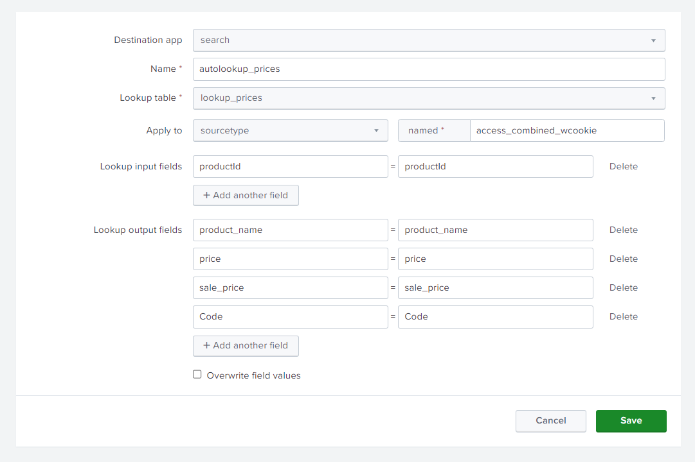

### Querys do Dashboard: [xml.query(SPL)](src/dashboard.xml)

### Relatório: [PDF](docs/Relatorio_Splunk_Lab07.pdf)

### Configurações
- Settings » Add Data
- Segment in path » Segment number: 1
- Lookups » Lookup table files » Add new (lookup_prices)
- Lookups » Lookup table files » lookup_prices » Permissions (All apps (system))
- Lookups » Lookup definitions » Add new
- Lookups » Automatic lookups » Add new

Automatic lookups Config:

